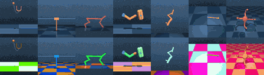
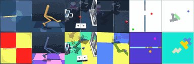

<h1 align="center">
    <p> <b>stable-worldmodel</b></p>
</h1>

<h2 align="center">
    <p><i>World model research made simple. From data collection to training and evaluation.</i></p>
</h2>

<div align="center" style="line-height: 1;">
  <a href="https://galilai-group.github.io/stable-worldmodel/" target="_blank" style="margin: 2px;"></a>
  <a href="https://github.com/galilai-group/stable-worldmodel" target="_blank" style="margin: 2px;"></a>
  <a href="https://pypi.python.org/pypi/stable-worldmodel/#history" target="_blank" style="margin: 2px;"></a>
  <a href="https://pytorch.org/get-started/locally/" target="_blank" style="margin: 2px;"></a>
  <a href="https://github.com/astral-sh/ruff" target="_blank" style="margin: 2px;"></a>
</div>

<p align="center">
  <a href="#quick-example"><b>Quick Example</b></a> | <a href="#supported-environments"><b>Environments</b></a> | <a href="#installing-stable-worldmodel"><b>Installation</b></a> | <a href="https://galilai-group.github.io/stable-worldmodel/"><b>Documentation</b></a> | <a href="#contributing"><b>Contributing</b></a> | <a href="#citation"><b>Citation</b></a>
</p>


## Quick Example

```python
import stable_worldmodel as swm
from stable_worldmodel.data import HDF5Dataset
from stable_worldmodel.policy import WorldModelPolicy, PlanConfig
from stable_worldmodel.solver import CEMSolver

# collect a dataset
world = swm.World('swm/PushT-v1', num_envs=8)
world.set_policy(your_expert_policy)
world.record_dataset(dataset_name='pusht_demo', episodes=100)

# load dataset and train your world model
dataset = HDF5Dataset(name='pusht_demo', num_steps=16)
world_model = ...  # your world-model

# evaluate with model predictive control
solver = CEMSolver(model=world_model, num_samples=300)
policy = WorldModelPolicy(solver=solver, config=PlanConfig(horizon=10))

world.set_policy(policy)
results = world.evaluate(episodes=50)
print(f"Success Rate: {results['success_rate']:.1f}%")
```

stable-worldmodel eases reproducibility by already implementing several baselines: [`scripts/train/prejepa.py`](scripts/train/prejepa.py) reproduces results from the [DINO-WM paper](https://arxiv.org/abs/2411.04983) and [`scripts/train/gcivl.py`](scripts/train/gcivl.py) implements several [goal-conditioned RL algorithms](https://arxiv.org/abs/2410.20092).
Multiple dataset formats are supported: MP4 for easy inspection and HDF5 for efficient clip loading, reducing CPU bottlenecks and improving GPU utilization.
To foster research in MPC for world models, several planning solvers are already implemented, including zeroth-order ([CEM](stable_worldmodel/solver/cem.py),[MPPI](stable_worldmodel/solver/mppi.py)), as well as [gradient-based](stable_worldmodel/solver/gd.py) approaches.

See the full documentation [here](https://galilai-group.github.io/stable-worldmodel/).

## Supported Environments

<p align="center">
  
  <br>
  
</p>

stable-worldmodel supports a large collection of environments from the [DeepMind Control Suite](https://github.com/google-deepmind/dm_control), [OGBench](https://github.com/seohongpark/ogbench), and classical world model benchmarks such as [Two-Room](https://arxiv.org/abs/2411.04983) and [PushT](https://arxiv.org/abs/2303.04137).

Each environment includes visual and physical factor variations to evaluate robustness and generalization. New environments can easily be added to stable-worldmodel as they only need to follow the [Gymnasium](https://gymnasium.farama.org/) interface.

## Installing stable-worldmodel

stable-worldmodel is available on PyPI and can be installed with:

```bash
pip install stable-worldmodel
```

> **Note:** The library is still in active development.


## Contributing

We welcome contributions to stable-worldmodel.
Setup your codebase:

```bash
uv venv --python=3.10
source .venv/bin/activate
uv sync --all-extras --group dev
```

### Questions

If you have a question, please [file an issue](https://github.com/galilai-group/stable-worldmodel/issues).


## Citation

```bibtex
@misc{maes_lelidec2026swm-1,
      title={stable-worldmodel-v1: Reproducible World Modeling Research and Evaluation},
      author = {Lucas Maes and Quentin Le Lidec and Dan Haramati and
                Nassim Massaudi and Damien Scieur and Yann LeCun and
                Randall Balestriero},
      year={2026},
      eprint={2602.08968},
      archivePrefix={arXiv},
      primaryClass={cs.AI},
      url={https://arxiv.org/abs/2602.08968},
}
```
