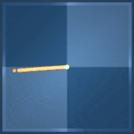
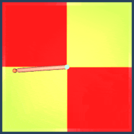
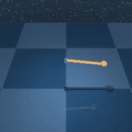
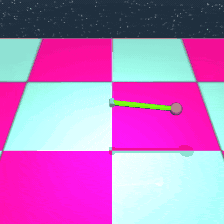
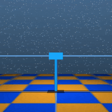
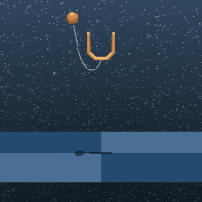
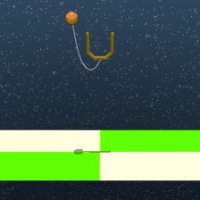
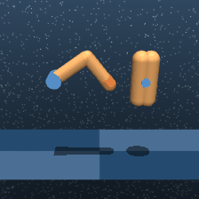
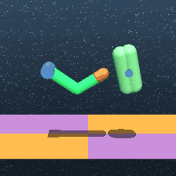

[](https://galilai-group.github.io/stable-worldmodel/)

[](https://pypi.python.org/pypi/stable-worldmodel/#history)
[](https://pytorch.org/get-started/locally/)
[](https://github.com/astral-sh/ruff)

# stable-worldmodel

World model research made simple. From data collection to training and evaluation.

```bash
pip install stable-worldmodel
```

> **Note:** The library is still in active development.

See the full documentation at [here](https://galilai-group.github.io/stable-worldmodel/).


## Quick Example

```python
import stable_worldmodel as swm
from stable_worldmodel.data import HDF5Dataset
from stable_worldmodel.policy import WorldModelPolicy, PlanConfig
from stable_worldmodel.solver import CEMSolver

# collect a dataset
world = swm.World('swm/PushT-v1', num_envs=8)
world.set_policy(your_expert_policy)
world.record_dataset(dataset_name='pusht_demo', episodes=100)

# load dataset and train your world model
dataset = HDF5Dataset(name='pusht_demo', num_steps=16)
world_model = ...  # your world-model

# evaluate with model predictive control
solver = CEMSolver(model=world_model, num_samples=300)
policy = WorldModelPolicy(solver=solver, config=PlanConfig(horizon=10))

world.set_policy(policy)
results = world.evaluate(episodes=50)
print(f"Success Rate: {results['success_rate']:.1f}%")
```

## Supported Environments

| Environment | Normal | Variations |
|:-----------:|:------:|:----------:|
| **Cheetah** |  |  |
| **Hopper** |  |  |
| **Walker** |  |  |
| **Quadruped** |  |  |
| **Reacher** |  |  |
| **Pendulum** |  |  |
| **Cartpole** |  |  |
| **Ball in Cup** |  |  |
| **Finger** |  |  |
| **Push-T** |  |  |
| **Two-Room** |  |  |
| **OGB Cube** |  |  |
| **OGB Scene** |  |  |

## Contributing

Setup your codebase:

```bash
uv venv --python=3.10
source .venv/bin/activate
uv sync --all-extras --group dev
```

## Questions

If you have a question, please [file an issue](https://github.com/galilai-group/stable-worldmodel/issues).


## Citation

```bibtex
@misc{maes_lelidec2026swm-1,
      title={stable-worldmodel-v1: Reproducible World Modeling Research and Evaluation}, 
      author = {Lucas Maes and Quentin Le Lidec and Dan Haramati and
                Nassim Massaudi and Damien Scieur and Yann LeCun and
                Randall Balestriero},
      year={2026},
      eprint={2602.08968},
      archivePrefix={arXiv},
      primaryClass={cs.AI},
      url={https://arxiv.org/abs/2602.08968}, 
}
```