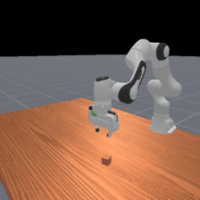
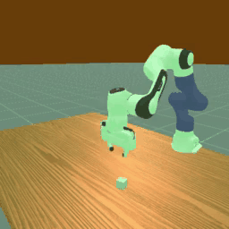

!!! danger "Vulkan support is required"
    ManiSkill3 uses [SAPIEN](https://sapien.ucsd.edu/) as its rendering and
    physics backend, which depends on **Vulkan**. You will not be able to run
    these environments on a machine (or container) without a working Vulkan
    driver and ICD loader.

    Before using any ManiSkill environment, make sure that:

    - A Vulkan loader is installed (`libvulkan1` / `vulkan-loader`).
    - A GPU ICD is available (e.g. `nvidia_icd.json` for NVIDIA GPUs).
    - `vulkaninfo` runs successfully and lists your GPU.

    On headless clusters you typically need the NVIDIA driver installed with
    Vulkan support and, when running in containers, the ICD files mounted
    into the container. See the [ManiSkill installation guide](https://maniskill.readthedocs.io/en/latest/user_guide/getting_started/installation.html)
    for details.

## Description



ManiSkill3 is a GPU-parallelized robotics simulator offering a wide range of
contact-rich manipulation tasks built on top of SAPIEN. `stable-worldmodel`
wraps the **tabletop** task suite to match the standard `swm` API (flat state
observations, on-demand image rendering, and a `variation_space` for domain
randomization).

```python
import stable_worldmodel as swm
world = swm.World('swm/PickCubeManiSkill-v0', num_envs=4, image_shape=(128, 128))
```

## Available Environments

All tabletop wrappers inherit from `TableTopManiSkillWrapper` and share the
same default [variation space](#variation-space) (robot, ground, scene
lighting, gravity, and joint/contact physics). `PickCube` additionally
exposes cube and goal variations — see [PickCube-specific variations](#pickcube-specific-variations).

### Single-arm pick / place

| ID | Task | Description |
|----|------|-------------|
| `swm/PickCubeManiSkill-v0` | `PickCube-v1` | Pick up a cube and move it to a target position (Franka Panda). |
| `swm/PickCubeSO100ManiSkill-v0` | `PickCubeSO100-v1` | `PickCube` with the low-cost SO-100 arm. |
| `swm/PickCubeWidowXAIManiSkill-v0` | `PickCubeWidowXAI-v1` | `PickCube` with the WidowX-AI arm. |
| `swm/PickSingleYCBManiSkill-v0` | `PickSingleYCB-v1` | Pick up a YCB object sampled from the dataset and move it to a target. |
| `swm/PlaceSphereManiSkill-v0` | `PlaceSphere-v1` | Place a sphere into a container / target location. |

### Pushing / pulling / poking

| ID | Task | Description |
|----|------|-------------|
| `swm/PushCubeManiSkill-v0` | `PushCube-v1` | Push a cube to a target region on the table. |
| `swm/PullCubeManiSkill-v0` | `PullCube-v1` | Pull a cube toward the robot base to reach the target. |
| `swm/PullCubeToolManiSkill-v0` | `PullCubeTool-v1` | Use an L-shaped tool to pull a cube that is out of reach. |
| `swm/PokeCubeManiSkill-v0` | `PokeCube-v1` | Poke a cube with a peg to knock it to the goal. |
| `swm/PushTManiSkill-v0` | `PushT-v1` | ManiSkill3 version of the classic Push-T planar manipulation task. |
| `swm/RollBallManiSkill-v0` | `RollBall-v1` | Roll a ball on the table to a goal region. |

### Stacking

| ID | Task | Description |
|----|------|-------------|
| `swm/StackCubeManiSkill-v0` | `StackCube-v1` | Stack one cube on top of another. |
| `swm/StackPyramidManiSkill-v0` | `StackPyramid-v1` | Stack three cubes into a pyramid. |
| `swm/LiftPegUprightManiSkill-v0` | `LiftPegUpright-v1` | Lift a lying peg and stand it upright on the table. |

### Insertion / assembly

| ID | Task | Description |
|----|------|-------------|
| `swm/PegInsertionSideManiSkill-v0` | `PegInsertionSide-v1` | Insert a peg into a box through a side hole. |
| `swm/PlugChargerManiSkill-v0` | `PlugCharger-v1` | Plug a charger model into a wall socket. |
| `swm/AssemblingKitsManiSkill-v0` | `AssemblingKits-v1` | Insert a shaped object into its matching slot in a kit board. |

### Dual-arm

| ID | Task | Description |
|----|------|-------------|
| `swm/TwoRobotPickCubeManiSkill-v0` | `TwoRobotPickCube-v1` | Two robots hand off a cube out of each other's reach. |
| `swm/TwoRobotStackCubeManiSkill-v0` | `TwoRobotStackCube-v1` | Two robots cooperate to stack cubes. |

## Environment Specs

| Property | Value |
|----------|-------|
| Action Space | `Box` — end-effector delta pose (`pd_ee_delta_pose` by default) |
| Observation Space | `Box` — flattened state vector |
| Reward | Task-specific dense reward from ManiSkill3 |
| Physics | SAPIEN (Vulkan-backed), CPU simulation backend |
| Render Mode | `rgb_array` via SAPIEN |

### Constructor Arguments

All tabletop wrappers accept the same base arguments; extra `**make_kwargs`
are forwarded to `mani_skill.envs.make`.

| Arg | Type | Default | Description |
|-----|------|---------|-------------|
| `control_mode` | str | `pd_ee_delta_pose` | ManiSkill control mode. |
| `seed` | int | None | Seed for reset / variation sampling. |

`PickCubeManiSkillWrapper` accepts one extra argument:

| Arg | Type | Default | Description |
|-----|------|---------|-------------|
| `cube_half_size` | float | None (uses ManiSkill default, 0.02 for panda) | Half-edge length of the cube in meters. Applied once at env construction — the cube is rebuilt at the requested size. Not randomizable per-reset. |

```python
# Build an env with a larger cube (4 cm edge length)
env = PickCubeManiSkillWrapper(cube_half_size=0.04, seed=0)
```

### Control Modes

Every tabletop wrapper exposes the underlying ManiSkill `control_mode`
argument. The default is `pd_ee_delta_pose`; any control mode supported by
the task can be selected:

```python
from stable_worldmodel.envs.maniskill import PickCubeManiSkillWrapper

env = PickCubeManiSkillWrapper(control_mode='pd_joint_delta_pos', seed=0)
```

## Variation Space

The base tabletop variation space (shared by **all** wrappers) covers the
scene, lighting, gravity, and contact physics of elements common to every
tabletop task.

| Factor | Type | Description |
|--------|------|-------------|
| `robot.color` | RGBBox | Robot link base color (default: [0.8, 0.8, 0.8]) |
| `ground.color` | RGBBox | Ground plane base color (default: [0.5, 0.5, 0.5]) |
| `ambient.color` | RGBBox | Scene ambient light color (default: [0.3, 0.3, 0.3]) |
| `background.color` | RGBBox | Skybox / environment color (default: [0.0, 0.0, 0.0]) |
| `light.intensity` | Box(0.3, 1.5) | Directional light intensity (default: 1.0) |
| `physics.gravity_x` | Box(-3.0, 3.0) | Gravity x component in m/s² (default: 0.0) |
| `physics.gravity_y` | Box(-3.0, 3.0) | Gravity y component in m/s² (default: 0.0) |
| `physics.gravity_z` | Box(-15.0, -1.0) | Gravity z component in m/s² (default: -9.81) |
| `ground_physics.friction` | Box(0.1, 2.0) | Ground static & dynamic friction (default: 1.0) |
| `ground_physics.restitution` | Box(0.0, 0.8) | Ground restitution (default: 0.0) |
| `robot_physics.joint_friction` | Box(0.0, 1.0) | Friction applied to each robot active joint (default: 0.0) |
| `robot_physics.joint_damping` | Box(0.0, 10.0) | Damping coefficient on each robot active joint (default: 0.0) |

### PickCube-specific variations

`PickCubeManiSkillWrapper` extends the base space with cube and goal-site
variations:

| Factor | Type | Description |
|--------|------|-------------|
| `cube.color` | RGBBox | Cube base color (default: [1.0, 0.2, 0.2]) |
| `goal.color` | RGBBox | Goal site color (default: [0.2, 1.0, 0.2]) |
| `cube_physics.mass` | Box(0.02, 0.5) | Cube mass in kg (default: 0.1) |
| `cube_physics.friction` | Box(0.1, 2.0) | Cube static & dynamic friction (default: 0.5) |
| `cube_physics.restitution` | Box(0.0, 0.8) | Cube restitution / bounce (default: 0.1) |
| `cube_physics.linear_damping` | Box(0.0, 2.0) | Cube linear velocity damping (default: 0.0) |
| `cube_physics.angular_damping` | Box(0.0, 2.0) | Cube angular velocity damping (default: 0.05) |

```python
# Randomize a subset
world.reset(options={'variation': ['cube.color', 'light.intensity']})

# Randomize everything
world.reset(options={'variation': ['all']})
```



!!! note "Color application is best-effort"
    Colors are applied by walking the SAPIEN scene graph and updating render
    materials on each entity's render shapes. If an actor uses a shared
    texture or a procedurally-built mesh, the base color may be tinted
    rather than replaced.

## Notes

- Observations are returned as flat `float32` vectors; image observations
  are produced on demand via `render()` so they can be attached by
  `MegaWrapper` like the other `swm` environments.
- The wrapper runs ManiSkill in **CPU simulation mode** with `num_envs=1`
  per instance. Vectorization across environments is handled by
  `swm.World`, not by ManiSkill's internal GPU vectorization.
- Only `PickCube` currently exposes per-actor object/goal variations. For
  other tasks, extend the wrapper's `_build_variation_space` and
  `apply_variations` to add task-specific randomization (see
  [pick_cube.py](https://github.com/galilai-group/stable-worldmodel/blob/main/stable_worldmodel/envs/maniskill/table_top/pick_cube.py)
  for a reference implementation).
