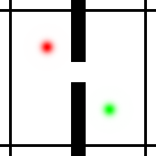
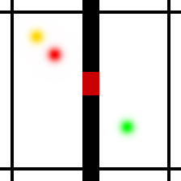

## Description

A 2D navigation task where a circular agent must reach a target position in another room by navigating through doorways. The environment uses PyTorch-based rendering and collision detection with a wall dividing the space into two rooms connected by one or more doors.

The agent starts in one room and must navigate to the target in the opposite room. The task requires planning a path through the door openings rather than simple point-to-point navigation.

**Success criteria**: The episode terminates when the agent is within the success radius of the target (≈15.5 px at the default 224×224 resolution).

```python
import stable_worldmodel as swm
world = swm.World('swm/TwoRoom-v1', num_envs=4, image_shape=(128, 128))
```

## Environment Specs

| Property | Value |
|----------|-------|
| Action Space | `Box(-1, 1, shape=(2,))` — 2D velocity direction |
| Observation Space | `Box(0, img_size, shape=(10,))` — state vector (224 by default) |
| Reward | 0 (sparse) |
| Episode Length | Until target reached or timeout |
| Render Size | Configurable via `img_size` (default 224×224) |
| Physics | Torch-based, 10 Hz control |

### Geometry Constants

All pixel quantities scale linearly from a 65×65 reference canvas, so the geometry is identical (in canvas-relative terms) at any `img_size`. Values below are for the default `img_size=224`:

| Constant | Value | Description |
|----------|-------|-------------|
| `IMG_SIZE` | 224 | Image dimensions (set by `img_size`) |
| `BORDER_SIZE` | 17 | Border thickness |
| `WALL_CENTER` | 112 | Wall position (center) = `IMG_SIZE // 2` |
| `MAX_DOOR` | 3 | Maximum number of doors |
| success radius | ≈15.5 | Distance to target for episode success |

### Observation Details

The observation is a flat state vector of shape `(10,)`:

| Index | Description |
|-------|-------------|
| 0-1 | Agent position (x, y) |
| 2-3 | Target position (x, y) |
| 4-9 | Door center positions (up to 3 doors × 2 coords) |

### Info Dictionary

The `info` dict returned by `step()` and `reset()` contains:

| Key | Description |
|-----|-------------|
| `env_name` | Environment name (`"TwoRoom"`) |
| `proprio` | Current agent position (numpy array) |
| `state` | Current agent position (numpy array) |
| `goal_state` | Target position (numpy array) |
| `distance_to_target` | Euclidean distance to target |

## Variation Space

<div style="display: flex; gap: 10px; margin-bottom: 20px;">
  
  
  
</div>


The environment supports extensive customization through the variation space:

| Factor | Type | Description |
|--------|------|-------------|
| `agent.color` | RGBBox | Agent color (default: red) |
| `agent.radius` | Box(3.4, 17.6) | Agent radius in pixels (default: ~5.9) |
| `agent.position` | Box | Starting position (can be either room) |
| `agent.speed` | Box(3.1, 24.8) | Movement speed in pixels/step (default: ~12.4) |
| `target.color` | RGBBox | Target color (default: green) |
| `target.radius` | Box(3.4, 17.6) | Target radius in pixels (default: ~5.9) |
| `target.position` | Box | Target position (constrained to the room opposite the agent) |
| `wall.color` | RGBBox | Wall color (default: black) |
| `wall.thickness` | Discrete(10, 42) | Wall thickness in pixels (default: 21) |
| `wall.axis` | Discrete(2) | 0: horizontal, 1: vertical (default: 1) |
| `wall.border_color` | RGBBox | Border color (default: black) |
| `door.color` | RGBBox | Door color (default: white) |
| `door.number` | Discrete(1, 3) | Number of doors (default: 1) |
| `door.size` | MultiDiscrete(1, 28) | Half-extent size of each door (default: 14) |
| `door.position` | MultiDiscrete(0, 224) | Center position of each door along wall (default: 103) |
| `background.color` | RGBBox | Background color (default: white) |
| `rendering.render_target` | Discrete(2) | Whether to render target (0: no, 1: yes) |

### Constraints

- **Agent position**: Must not overlap with the wall (collision-constrained)
- **Target position**: Constrained to the room opposite the agent (and outside the wall zone), so every episode requires a door traversal rather than degenerating into same-room point-to-point navigation. Because the constraint is evaluated against the agent's position, `target.position` is resampled together with `agent.position` (the defaults do both) — randomizing the agent alone can leave the fixed target in the same room and fail the variation check
- **Door position**: Each active door's opening must lie fully within the playable area, so every sampled door is a usable gap

### Default Variations

By default, these factors are randomized at each reset:

- `agent.position`
- `target.position`

To randomize additional factors:

```python
# Randomize colors for domain randomization
world.reset(options={'variation': ['agent.color', 'target.color', 'background.color']})

# Randomize everything
world.reset(options={'variation': ['all']})
```

## Datasets

| Name | Episodes | Policy | Download |
|------|----------|--------|----------|
| `tworoom_expert` | 1000 | Weak Expert | — |

## Expert Policy

This environment includes a built-in weak expert policy for data collection:

```python
from stable_worldmodel.envs.two_room import ExpertPolicy

policy = ExpertPolicy()
world.set_policy(policy)
```

## Two-Room DoorKey



A locked-door variant of Two-Room and a continuous analog of MiniGrid's DoorKey, registered as `swm/TwoRoomDoorKey-v1`. The doors start **locked** (impassable, drawn with `door.locked_color`) and a **key** is placed in the agent's room. When the agent reaches the key — within the same success radius used to reach the target — the key disappears, every door **unlocks** (redrawn with `door.unlocked_color`), and the agent can cross to the target. It is a thin subclass of `TwoRoomEnv`, so all collision physics, wall/door rendering, and the variation-space scaffolding are inherited.

```python
import stable_worldmodel as swm
world = swm.World('swm/TwoRoomDoorKey-v1', num_envs=4, image_shape=(128, 128))
```

<div style="display: flex; gap: 10px; margin-bottom: 20px;">
  
  
  
</div>

### Differences from Two-Room

Everything matches Two-Room except the following:

| Aspect | Two-Room | DoorKey |
|--------|----------|---------|
| Observation | `Box(0, img_size, (10,))` | `Box(0, img_size, (13,))` — appends `key_x`, `key_y`, `has_key` |
| Doors | always passable | start locked; unlock on key pickup |
| `door.color` | single color (white) | replaced by `door.locked_color` (red) + `door.unlocked_color` (white) |
| Key | — | adds `key.color` (gold), `key.radius`, `key.position` (in the agent's room) |
| Default variations | `agent.position`, `target.position` | `agent.position`, `key.position`, `target.position` |
| Info dict | as above | also includes `key_position` and `has_key` |

The key is picked up using the same threshold as reaching the target (the success radius), not a separate tunable.

### Expert Policy

```python
from stable_worldmodel.envs.two_room import DoorKeyExpertPolicy

policy = DoorKeyExpertPolicy()
world.set_policy(policy)
```
